# 🚀 Vaulta - Secure MERN Stack Authentication System 🚀

---


Vaulta is a robust and secure MERN stack application demonstrating a complete authentication system. It features modern security practices including OTP-based login, secure session management with JWT, CSRF protection, role-based access control, and advanced input validation. This project serves as a comprehensive boilerplate for building secure web applications.

## ✨ Features

* **User Registration with Email Verification**
* **Secure OTP-Based Login**
* **JWT-Based Session Management** (Access + Refresh tokens in HTTP-only cookies)
* **CSRF Protection**
* **Role-Based Access Control (RBAC)**
* **Single Session Enforcement**
* **Efficient Caching with Redis**
* **Zod Validation** (schema validation for input)
* **Mongo-sanitize** (protection against NoSQL injection)
* **Modern Frontend** with React + Tailwind
* **Automated Email Service** with Nodemailer

## 🛠️ Tech Stack

### Frontend

* React + Vite
* React Router
* Axios
* Tailwind CSS
* React Toastify

### Backend

* Node.js + Express
* MongoDB + Mongoose
* Redis
* JWT (Access & Refresh tokens)
* Nodemailer
* Bcrypt
* Zod
* Mongo-sanitize

## 🔑 Environment Variables

| Variable         | Description                             |
| ---------------- | --------------------------------------- |
| `MONGO_URI`      | MongoDB connection string.              |
| `PORT`           | Backend server port.                    |
| `REDIS_URL`      | Redis connection URL.                   |
| `FRONTEND_URL`   | Frontend base URL.                      |
| `JWT_SECRET`     | Secret for access tokens.               |
| `REFRESH_SECRET` | Secret for refresh tokens.              |
| `SMTP_USER`      | SMTP email address.                     |
| `SMTP_PASSWORD`  | SMTP password or app-specific password. |

## 🗺️ API Endpoints

| Method | Endpoint                | Description                        |
| ------ | ----------------------- | ---------------------------------- |
| `POST` | `/api/v1/register`      | Register a new user.               |
| `POST` | `/api/v1/verify/:token` | Verify email with token.           |
| `POST` | `/api/v1/login`         | Login and send OTP.                |
| `POST` | `/api/v1/verify`        | Verify OTP and issue tokens.       |
| `GET`  | `/api/v1/me`            | Get profile of logged-in user.     |
| `POST` | `/api/v1/refresh`       | Refresh access token.              |
| `POST` | `/api/v1/logout`        | Logout and clear session.          |
| `POST` | `/api/v1/refresh-csrf`  | Refresh CSRF token.                |
| `GET`  | `/api/v1/admin`         | Admin-only protected route (RBAC). |

## 🔄 Authentication Flow

```mermaid
flowchart TD
    A[User Registers] --> B[Backend validates with Zod ]
    B --> C[Sanitizes Input]
    C --> D[Send Email Verification Link]

    D -->|Click Link| E[Verify Email Token]
    E --> F[Store user in MongoDB]

    F --> G[Login with Credentials]
    G --> H[Sanitize Input + Check Password]
    H --> I[Send OTP via Email]

    I -->|Enter OTP| J[Verify OTP in Redis]
    J --> K[Issue JWT Access + Refresh Tokens in HTTP-only Cookies]

    K --> L[User Accesses Protected Routes]
    L --> M[CSRF Tokens for Sensitive Actions]

    K --> N[Role Check → Admin/User]
    N --> O[Dashboard / Admin Panel]
```



## 📁 Project Structure

```
vaulta/
├── backend/
│   ├── config/             # Config files (DB, JWT, Redis, etc.)
│   ├── controllers/        # Business logic
│   ├── middlewares/        # Auth, CSRF, error handlers
│   ├── models/             # Mongoose models
│   ├── routes/             # Express routes
│   └── index.js            # Backend entry point
└── frontend/
    ├── public/             # Static assets
    └── src/
        ├── api/            # API interceptors
        ├── components/     # UI components
        ├── context/        # Global state
        ├── pages/          # Page-level components
        └── App.jsx         # Main app & routing
```

## 📜 License

This project is licensed under the MIT License - see the [LICENSE](LICENSE.md) file for details.

## 👤 Author

**Abhishek Negi**

* GitHub: [@nEgiAbhi1809](https://github.com/nEgiAbhi1809)
* LinkedIn: [negi-abhi1809](https://www.linkedin.com/in/negi-abhi1809)

---

👉 Do you want me to also add a **"Future Improvements"** section (like 2FA with Authenticator apps, Docker setup, CI/CD) so recruiters see you’re thinking ahead?
